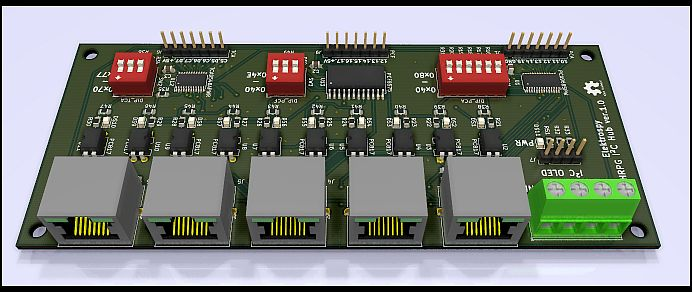
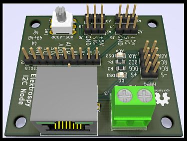
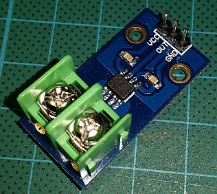

# I2C Powersupply Monitor Hub 

This repository contains the schematics and sourcecode for the I2C powersupply monitor hub.

This project is used to monitor and control the HRPG-300 power supplies of the ceiling pixel lamp.
https://github.com/c3e/CeilingPixelLamp

* Control:
	* toggle power output of single power supply
* Monitor:
	* if supply output is active
	* current power consumption for every 5 led panel (10 per power supply)

### Hardware used
* ACS712 30A version
	* Hallsensor based current measuring
* TCA9548A
	* Low-Voltage 8-Channel I2C Switch with Reset
* PCF8575 
	* Remote16-BIT I2C AND SMBus I/O Expander with Interrupt Output
* PCA9685
	* 16-channel, 12-bit PWM Fm+ I2C-bus LED controller
* ADS1015
	* I2C 4-Channel 12-Bit ADC
* PC817
	* High Density Mounting Type Photocoupler

## I2C Hub

I2C Hub Board for I2C Nodes

## I2C Node

I2C Node Board + GY-712 30A
